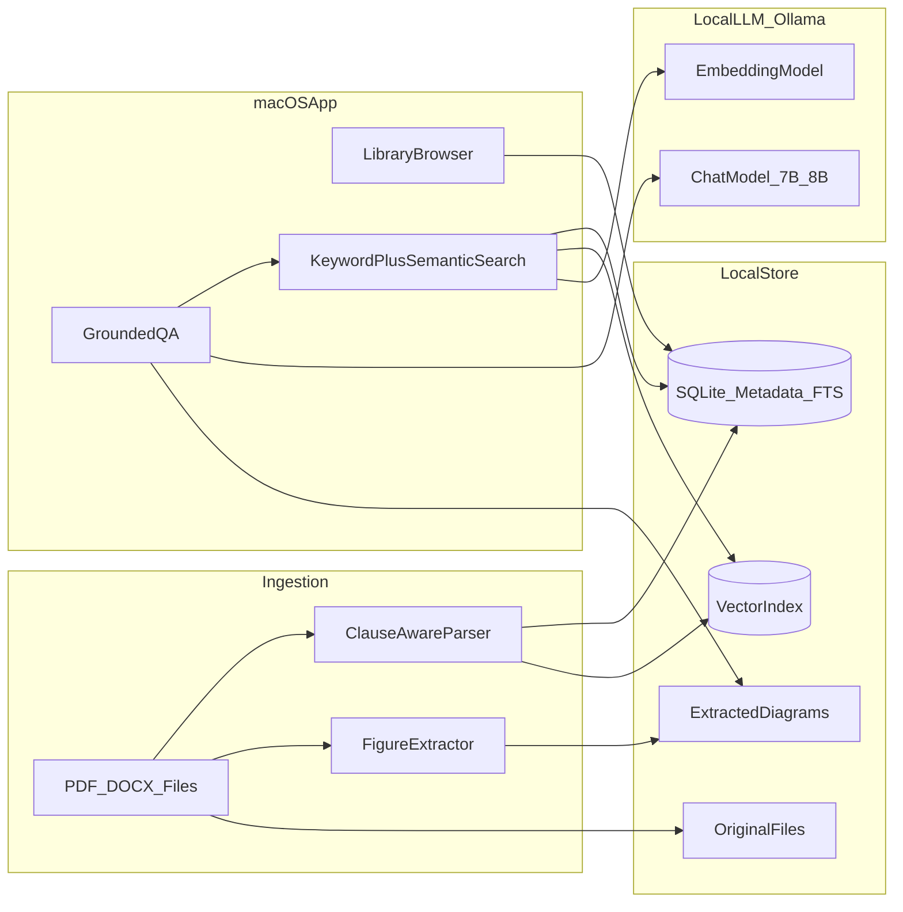

# macOS ISO Standards Knowledge Base — Architecture Plan

## Recommendation: Build an app **with** a local LLM (RAG), not one or the other

Your two options are not mutually exclusive. The right answer for ISO standards (clauses, diagrams, compliance-sensitive text) is:

| Approach | Verdict |
|---|---|
| **Keyword search only** | Good for exact clause numbers, weak for natural-language questions |
| **"Feed all PDFs to a local LLM"** | Will fail at your scale (50–500 files); context limits, hallucinations, no reliable citations |
| **macOS app + local RAG pipeline** | **Recommended** — structured storage, hybrid search, grounded answers with citations |



---

## Why RAG beats "just use a local LLM"

ISO documents need **precision**, not creative answers:

1. **Context limits** — Even a 128K-token model cannot hold hundreds of standards at once.
2. **Hallucination risk** — Unacceptable for clause-level compliance questions.
3. **Citation requirement** — You need "ISO 9001:2015, Clause 8.5.1, page 42", not a paraphrase.
4. **Diagrams** — LLMs cannot "see" embedded PDF figures unless you extract and link them during indexing.

RAG works by: **retrieve relevant chunks first → pass only those chunks to the local LLM → require citations from retrieved text only**.

---

## Recommended stack (fully offline, medium corpus)

### macOS application shell
- **SwiftUI native app** — best macOS integration (folder picker, Quick Look, drag-and-drop import, menu bar search).
- App owns the UX: library tree, clause browser, search results, Q&A panel, diagram viewer.

### Local intelligence layer
- **[Ollama](https://ollama.com)** (runs as a local daemon, no cloud):
  - **Embeddings**: `nomic-embed-text` or `mxbai-embed-large` for semantic search
  - **Chat model**: `llama3.1:8b` or `mistral:7b` (good balance on Apple Silicon with 16GB+ RAM)
- Alternative on Apple Silicon: **MLX** for faster inference if you want tighter integration later.

### Storage (all local, ~2–20 GB corpus)
- **Original files**: user-selected folder (e.g. `~/Documents/ISO-Library/`) — app indexes, does not duplicate unless you want a managed vault.
- **SQLite** (single `library.db`):
  - Document metadata (standard ID, title, edition, file path, hash)
  - Clause tree (`4`, `4.1`, `4.1.1`, Annex A, etc.)
  - Full-text index via **FTS5** for keyword/clause search
  - Chunk table with page numbers and clause IDs
- **Vector index**: `sqlite-vec` extension or **LanceDB** (embedded, no server) for semantic retrieval
- **Extracted figures**: PNG/SVG per page/figure, linked to nearest clause chunk

### Document ingestion (runs as background job inside the app)
- **PDF**: PyMuPDF (`fitz`) or PDFKit — text + bounding boxes + image extraction
- **Word (.docx)**: `python-docx` or Swift-based parser
- **Clause-aware chunking** (critical for ISO):
  - Detect headings matching patterns like `^\d+(\.\d+)*`, `Annex [A-Z]`, `Figure \d+`
  - Chunk by clause boundary, not arbitrary 512-token splits
  - Attach metadata: `{standard: "ISO 27001:2022", clause: "A.5.1", page: 17, type: "requirement|note|figure"}`

### Search modes (both in v1 scope)
1. **Keyword / clause search** — instant, FTS5, supports `"8.5.1"`, `"risk assessment"`, boolean filters by standard
2. **Semantic search** — embedding similarity across all indexed chunks
3. **Hybrid ranking** — combine FTS score + vector score (Reciprocal Rank Fusion)

### Q&A mode (v1.1 or v1 if time permits)
- User question → hybrid retrieval (top 8–15 chunks + linked figures) → local LLM prompt with strict grounding rules:
  - "Answer ONLY from the provided excerpts. Cite clause and standard for every claim. Say 'Not found in library' if insufficient evidence."
- Return: answer text + source cards (clause, page, snippet) + thumbnail of related diagram with "Open in document" action

---

## What NOT to build

- **Do not** train or fine-tune your own LLM — unnecessary for this use case; RAG on a general 7B/8B model is sufficient.
- **Do not** use cloud APIs (your offline requirement rules this out anyway).
- **Do not** start with a web/Electron app — native macOS gives better file system access and offline performance.
- **Do not** skip structured clause parsing — generic PDF chunking will break ISO numbering and cross-references.

---

## Project structure (greenfield)

```
ISOStandardsKB/
├── ISOStandardsKB/          # SwiftUI macOS app
│   ├── Views/               # Library, Search, QADetail, FigureViewer
│   ├── Models/              # Document, Clause, Chunk, SearchResult
│   └── Services/            # IndexCoordinator, OllamaClient, FileWatcher
├── indexer/                 # Python ingestion (bundled or invoked by app)
│   ├── parsers/             # pdf_parser, docx_parser, clause_detector
│   ├── extractors/          # figure_extractor
│   └── pipeline.py          # ingest(file) -> chunks + vectors + figures
├── resources/
│   └── schema.sql           # SQLite schema + FTS5 + vec tables
└── scripts/
    └── bundle_python.sh     # Package indexer for macOS app bundle
```

The Swift app launches the Python indexer as a subprocess (or XPC service) for ingestion; search and Q&A call Ollama via localhost HTTP.

---

## Phased implementation

### Phase 1 — Library + keyword search (foundation)
- Create SwiftUI app with folder import and document list
- Build SQLite schema and FTS5 indexing
- Implement PDF/DOCX text extraction and ISO clause detection
- Search UI: keyword + clause number + filter by standard
- **Outcome**: usable offline reference library with fast exact search

### Phase 2 — Semantic search
- Install/configure Ollama with embedding model
- Generate and store vectors during ingestion
- Add hybrid search ranking in the app
- **Outcome**: natural-language discovery ("requirements for documented information")

### Phase 3 — Grounded Q&A with citations
- Add Ollama chat model integration
- RAG prompt template with mandatory citations
- Source panel showing clause excerpts; click to open original PDF at page
- **Outcome**: ask questions, get answers grounded in your files only

### Phase 4 — Diagrams and polish
- Extract and index figures; link to parent clause
- Inline diagram preview in search/Q&A results
- File watcher for re-index on add/update
- Export search results / audit trail (useful for compliance workflows)

---

## Hardware expectations (fully offline, medium corpus)

| RAM | Recommended models |
|---|---|
| 8 GB | Embeddings only + keyword search; skip local chat LLM |
| 16 GB | `llama3.1:8b` Q4 + embeddings — workable |
| 24 GB+ | Comfortable Q&A experience, faster indexing |

Apple Silicon (M1/M2/M3) strongly recommended for MLX/Ollama performance.

---

## Key design decisions to lock in early

1. **Managed vault vs index-in-place** — Start with *index-in-place* (point app at existing folder); add optional copy-to-vault later.
2. **Python sidecar vs pure Swift** — Python for ingestion (rich PDF/DOCX ecosystem) + Swift for UI is the fastest path; migrate hot paths to Swift only if needed.
3. **Re-index strategy** — Hash-based change detection; background re-index on file modification.
4. **Answer policy** — Strict grounding: no answer without retrieved sources; always show clause citations.

---

## Success criteria

- Import a folder of ISO PDFs/DOCX and browse by standard and clause tree
- Keyword search returns correct clause in under 200ms
- Question like *"What does ISO 27001 require for access control?"* returns cited excerpts from indexed files only
- Related diagram appears when the source clause references a figure
- Entire workflow works with Wi‑Fi disabled

---

## Estimated effort

| Phase | Scope | Rough effort |
|---|---|---|
| Phase 1 | Library + FTS + clause parsing | 2–3 weeks |
| Phase 2 | Embeddings + hybrid search | 1–2 weeks |
| Phase 3 | RAG Q&A + citations | 1–2 weeks |
| Phase 4 | Diagrams + file watcher + polish | 1–2 weeks |

Total: **5–9 weeks** for a solo developer, depending on Swift/Python familiarity.
